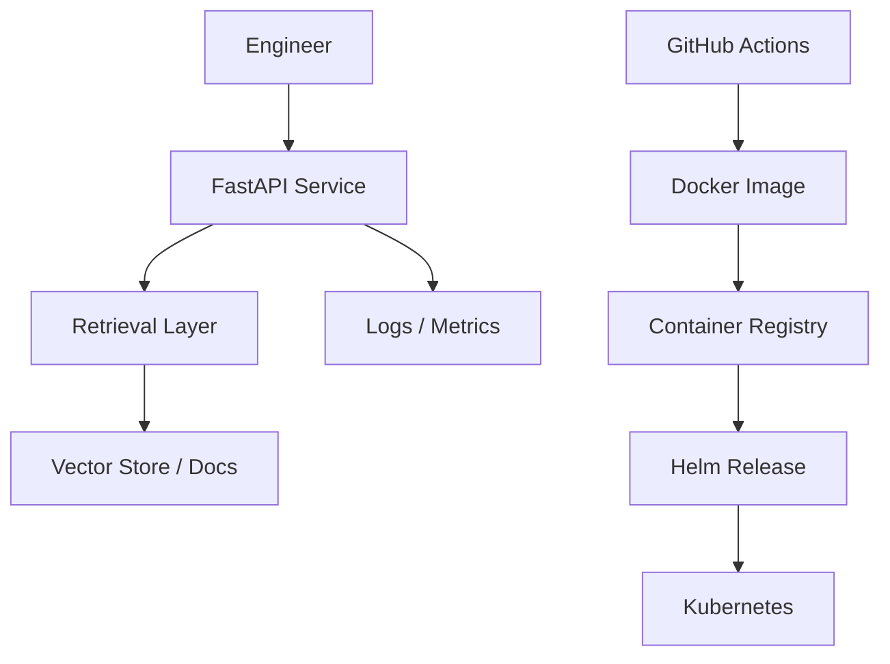

# Architecture

```mermaid
flowchart TB
    User[Engineer] --> Api[FastAPI Service]
    Api --> Retriever[Retrieval Layer]
    Retriever --> Store[Vector Store / Docs]
    Api --> Telemetry[Logs / Metrics]
    CI[GitHub Actions] --> Image[Docker Image]
    Image --> Registry[Container Registry]
    Registry --> Helm[Helm Release]
    Helm --> K8s[Kubernetes]
```
